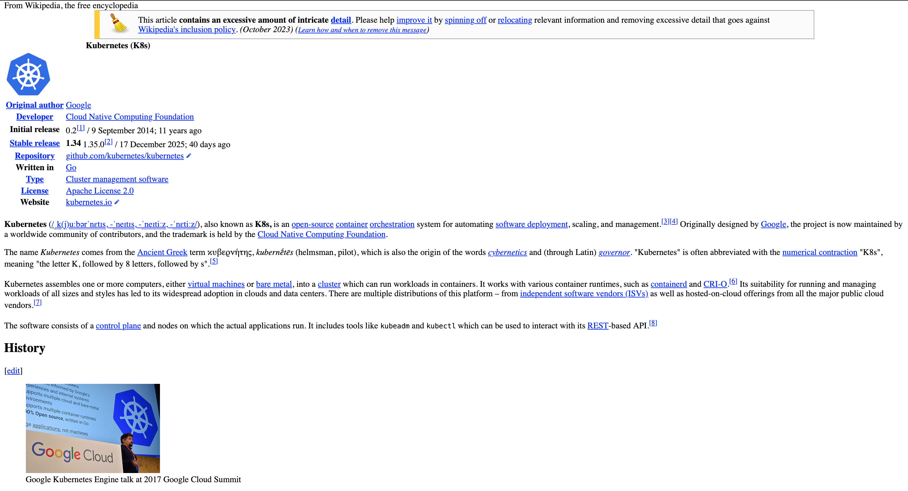

# Exercise 5.1: DummySite Controller

A Kubernetes Custom Controller that watches `DummySite` resources and creates a Deployment serving the content of the specified `website_url`.

**Components**

1.  **CRD** (`manifests/dummysite-crd.yaml`): Defines the `DummySite` resource (Group: `devopsk8s.dwk`, Version: `v1`).
2.  **Controller** (`controller/`): Python script that watches the API and creates Deployments.
3.  **RBAC** (`manifests/rbac.yaml`): Grants the controller permission to manage Deployments and watch DummySites.
4.  **Deployment** (`manifests/controller-deployment.yaml`): Deploys the controller itself.


### Build the Controller Image

Build and push the controller image to docker hub:

```bash
docker buildx build \
  --platform linux/amd64,linux/arm64 \
  -t gedionkip/k8s-submissions:dummy-controller \
  --push \
  .
```

### Deploy the Components
Use `kubectl` (or Kustomize via `kustomization.yaml`):

```bash
kubectl apply -k dummy_site
```

### Create a DummySite 
Apply a custom resource to trigger the controller:

```bash
kubectl apply -f manifests/dummysite.yaml
```

### Verify
The controller will create a Deployment named `example-site`.
```bash
kubectl port-forward deployment/example-site 8080:80
```
On `http://localhost:8080` you should see the content of the website specified in the DummySite resource.

