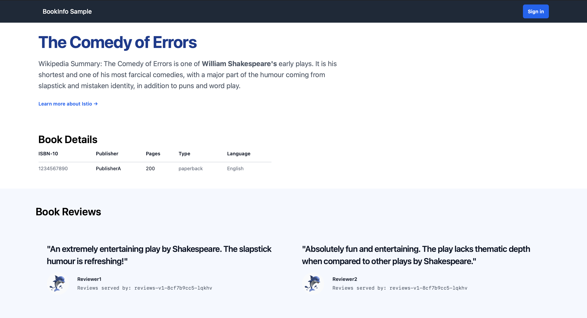
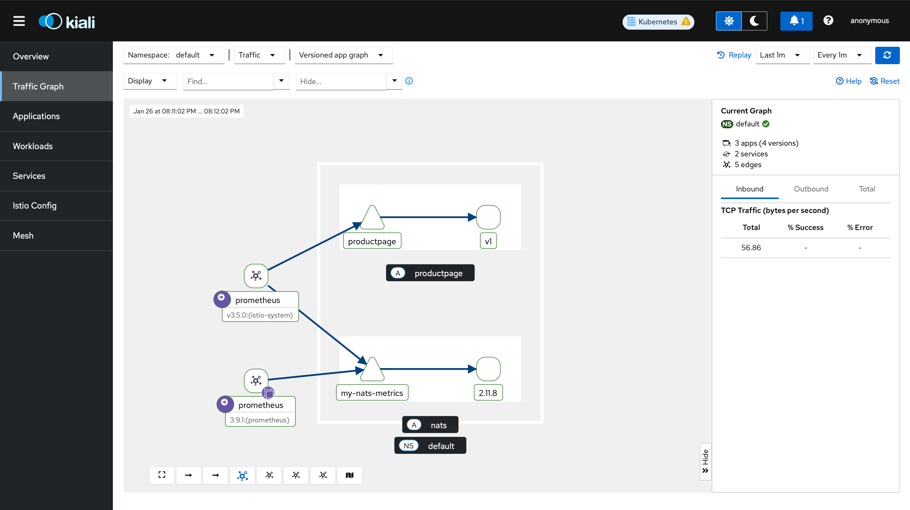
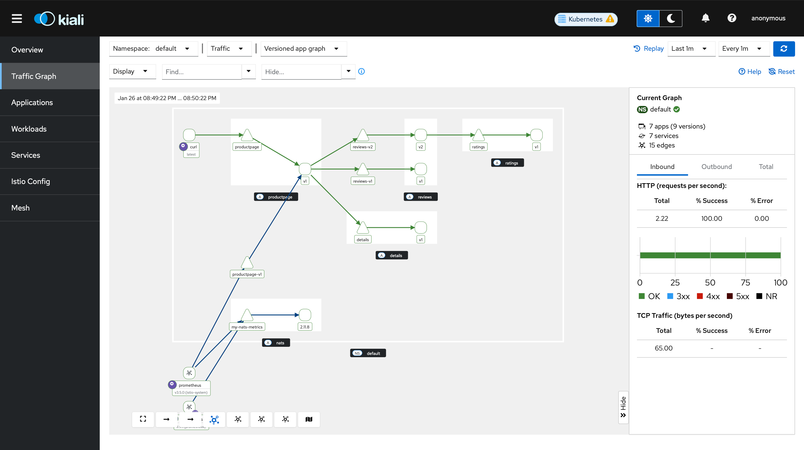

## Exercise 5.2: Istio Ambient Mesh

I'm running a bare-metal K8s cluster instead of using k3d.

### Install Istio
Install Istio with the `ambient` profile, which sets up the **ztunnel** (Zero Trust Tunnel) DaemonSet and Istio CNI.

```bash
istioctl install --set profile=ambient --skip-confirmation
```

**Verify Installation:**
Ensure `ztunnel` and `istiod` are running:
```bash
kubectl get pods -n istio-system
```

### Deploy Sample App (Bookinfo)
We deploy the Bookinfo application without any sidecars.

```bash
# Deploy the application and the gateway
cd exercise-5.2/sample-app
kubectk apply -k .
```

**Verify App:**
Check that pods are running in the `default` namespace:
```bash
kubectl get pods
```

Change the service type to ClusterIP by annotating the gateway:
```bash
kubectl annotate gateway bookinfo-gateway networking.istio.io/service-type=ClusterIP --namespace=default
```
Access the sample app via portforward:
```bash
kubectl port-forward svc/bookinfo-gateway-istio 8080:80
```
Then `http://localhost:8080/productpage` should show the Bookinfo application.



### Add Sample App to the mesh
In Ambient mode, you don't inject sidecars. Instead, you label the namespace to tell Istio to manage traffic for it.

```bash
kubectl label namespace default istio.io/dataplane-mode=ambient
```
### Visualize the application and metrics
Using Istio’s dashboard, Kiali, and the Prometheus metrics engine, we can visualize the Bookinfo application with the following deployments:
```bash
# Prometheus
kubectl apply -f https://raw.githubusercontent.com/istio/istio/release-1.28/samples/addons/prometheus.yaml
# Kiali
kubectl apply -f https://raw.githubusercontent.com/istio/istio/release-1.28/samples/addons/kiali.yaml
```
Generate some traffic to the application:
```bash
for i in $(seq 1 100); do curl -sSI -o /dev/null http://localhost:8080/productpage; done
```
Acess the Kiali dashboard at `http://localhost:20001/kiali`:
```bash
istioctl dashboard kiali
```
Bookinfo app Traffic Graph:



### Enforce Layer 4 Authorization Policy

The policy is applied to pods with the app: productpage label, and it allows calls only from the service account cluster.local/ns/default/sa/bookinfo-gateway-istio.

```bash
kubectl apply -f manifests/auth-policy-4.yaml
```
Deploy a test app:
```bash
kubectl apply -f manifests/curl.yaml
```
### Enforce Layer 7 Authorization Policy

To enforce Layer 7 policies, you first need a waypoint proxy for the namespace. This proxy will handle all Layer 7 traffic entering the namespace.

```bash
istioctl waypoint apply --enroll-namespace --wait
```
Adding an L7 authorization policy will explicitly allow the curl service to send GET requests to the productpage service, but perform no other operations:

```bash
kubectl apply -f manifests/auth-policy-7.yaml
```
We now need to update it to also allow connections from the waypoint.

```bash
kubectl apply -f manifests/auth-policy-4-updated.yaml
```

### Split traffic between services

We can configure traffic routing to send 90% of requests to reviews v1 and 10% to reviews v2:

```bash
kubectl apply -f manifests/traffic-route.yaml
```
Simulate some traffic for testing:
```bash
kubectl exec deploy/curl -- sh -c "for i in \$(seq 1 100); do curl -s http://productpage:9080/productpage | grep reviews-v.-; done"
```
Then the graph:



### Clean UP

Remove all the waypoint proxies:
```bash
kubectl label namespace default istio.io/use-waypoint-
istioctl waypoint delete --all
```
Remove namespace from the ambient data plane:
```bash
kubectl label namespace default istio.io/dataplane-mode-
```
Remove the Bookinfo sample app and curl deployment:
```bash
kubectl delete httproute reviews
kubectl delete authorizationpolicy productpage-viewer
kubectl delete -k .
kubectl delete -f manifests/curl.yaml
```

Istio can be uninstalled with:
```bash
istioctl uninstall -y --purge
kubectl delete namespace istio-system
```
The Kubernetes Gateway API CRDs can be removed with:
```bash
kubectl delete -f https://github.com/kubernetes-sigs/gateway-api/releases/download/v1.4.0/experimental-install.yaml
```