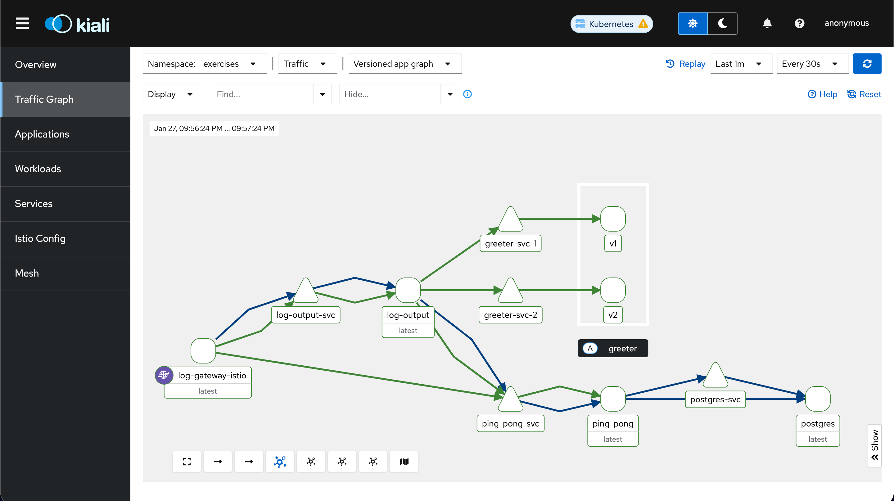

## Exercise 5.3: Log App, Service Mesh

Build and push the `greeter` and the updated `log_reader` images to Docker Hub:

```bash
# Build Greeter
cd greeter
docker buildx build \
  --platform linux/amd64,linux/arm64 \
  -t gedionkip/k8s-submissions:greeter \
  --push \
  .

# Build Log Reader (Updated)
cd log_output/log_reader
docker buildx build \
  --platform linux/amd64,linux/arm64 \
  -t gedionkip/k8s-submissions:log-reader-v2 \
  --push \
  .
```

### Deploy
If the Log-Output and Pingpong apps were not deployed yet, then deploy them first.

```bash
kubectl apply -k .
```

Apply the manifests to the `exercises` namespace:

```bash
kubectl apply -k greeter
```
If it was already deployed, then you need to restart the deployment.

```bash
kubectl rollout restart deployment log-output -n exercises
```

Simulate traffic to the log-output app

```bash
for i in $(seq 1 100); do curl -sSI -o /dev/null http://gateway_ip/; done
```
Then acess Kiali dashboard:
```bash
istioctl dashboard kiali
```
Then check the graph:


