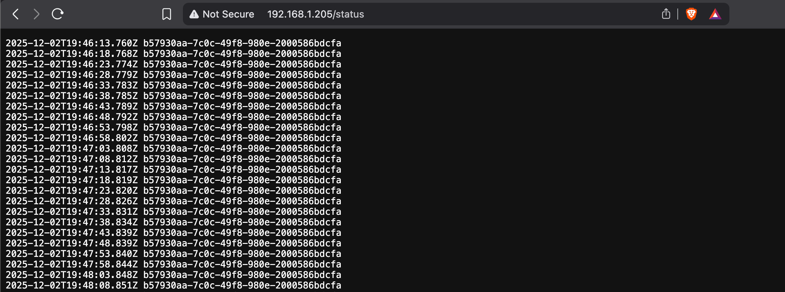

# Log Output App

This is the Log Output app implemented as **two separate Node.js applications in two directories**, combined into a **single pod**:

- `log_generator/`: generates a random UUID on startup and writes a line with the UUID and timestamp every 5 seconds into a shared file.
- `log_reader/`: exposes an HTTP endpoint that reads that shared file and returns the contents.

### Build and Push Docker Images

Build and push the two containers:

```bash
# Generator App Image
docker buildx build \
  --platform linux/amd64,linux/arm64 \
  -t gedionkip/k8s-submissions:1.10.1 \
  --push \
  .

# Reader App Image
docker buildx build \
  --platform linux/amd64,linux/arm64 \
  -t gedionkip/k8s-submissions:1.10.2 \
  --push \
  .
```

### Kubernetes Deployment

Deploy the app in Kubernetes using the `yaml` manifest:

```bash
kubectl apply -f manifests/
```

### Check the Application Logs

```bash
~❯ kubectl logs log-output-7fb967f5b7-gvtvj --all-containers=true     
Generator starting. Using file: /shared/status.log
Wrote line: 2025-12-02T19:46:13.760Z b57930aa-7c0c-49f8-980e-2000586bdcfa
Wrote line: 2025-12-02T19:46:18.768Z b57930aa-7c0c-49f8-980e-2000586bdcfa
Wrote line: 2025-12-02T19:46:23.774Z b57930aa-7c0c-49f8-980e-2000586bdcfa
Wrote line: 2025-12-02T19:46:28.779Z b57930aa-7c0c-49f8-980e-2000586bdcfa
Wrote line: 2025-12-02T19:46:33.783Z b57930aa-7c0c-49f8-980e-2000586bdcfa
Wrote line: 2025-12-02T19:46:38.785Z b57930aa-7c0c-49f8-980e-2000586bdcfa
Wrote line: 2025-12-02T19:46:43.789Z b57930aa-7c0c-49f8-980e-2000586bdcfa
Wrote line: 2025-12-02T19:46:48.792Z b57930aa-7c0c-49f8-980e-2000586bdcfa
Wrote line: 2025-12-02T19:46:53.798Z b57930aa-7c0c-49f8-980e-2000586bdcfa
Wrote line: 2025-12-02T19:46:58.802Z b57930aa-7c0c-49f8-980e-2000586bdcfa
Wrote line: 2025-12-02T19:47:03.808Z b57930aa-7c0c-49f8-980e-2000586bdcfa
...
Reader started on port 3000, serving file: /shared/status.log
```
### Accessing the HTTP GET endpoint

The HTTP GET endpoint i.e `/status`, also serves the shared file to the user:


