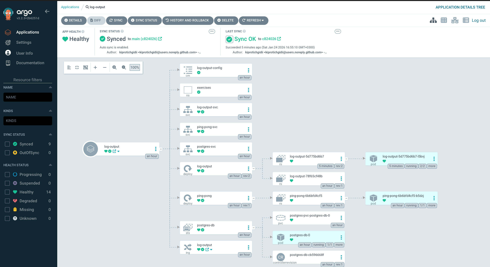

## Exercise 4.7:  Baby Steps to GitOps

This application is managed using **GitOps** principles with **ArgoCD** and **GitHub Actions**.

- **Source of Truth**: The `kustomization.yaml` at the repository root defines the desired state;

- **CI Pipeline**: A GitHub Action (`.github/workflows/log-output.yaml`) automatically:
    1.  Builds new Docker images for `log-generator` and `log-reader` on changes to `log_output/**`.
    2.  Pushes them to Docker Hub.
    3.  Updates the root `kustomization.yaml` with the new image tags.
    4.  Commits the change back to the repository.

- **CD Controller**: **ArgoCD** watches the repository root and syncs the cluster state to match `kustomization.yaml`.

Added secrets `DOCKER_USERNAME` and `DOCKER_PASSWORD` to GitHub and installed ArgoCD in the cluster with:

```bash
kubectl apply -f log_output/manifests/argocd.yaml
```
Pushed changes to `main` and verified that the GitHub Action completed successfully.

ArgoCD UI after pushing chnages to GitHub:

