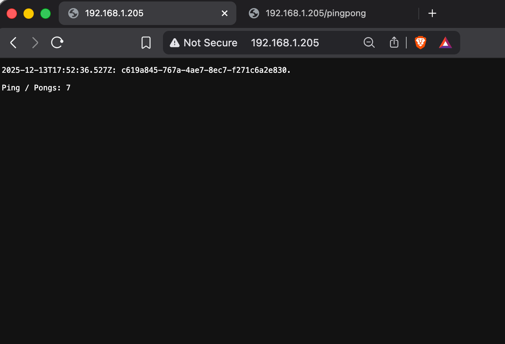

# Ping-pong and Log output

This project demonstrates two microservices, `Ping-pong` and `Log output`, communicating via HTTP.

1.  **Ping-pong App**:
    *   Exposes an HTTP endpoint `GET /` (or `/pingpong`) that returns a "pong N" message.
    *   Exposes `GET /pings` to return just the current counter value `N`.
    *   The counter is stored in-memory (reset on pod restart).

2.  **Log-output App**:
    *   Consists of a `log-generator` that writes timestamps to an internal ephemeral volume.
    *   Consists of a `log-reader` that:
        *   Reads the latest timestamp from the internal volume.
        *   Fetches the current ping count from the `Ping-pong` app via `http://ping-pong-svc:80/pings`.
        *   Aggregates and displays the status.

## Build and Push Images

```bash
# PING-PONG (v2.1.0)
docker buildx build \
  --platform linux/amd64,linux/arm64 \
  -t gedionkip/k8s-submissions:2.1.0 \
  --push \
  ping_pong

# LOG-GENERATOR (v2.1.1 - unchanged, just updating tags)
cd ../log_output/log_generator
docker buildx build \
  --platform linux/amd64,linux/arm64 \
  -t gedionkip/k8s-submissions:2.1.1 \
  --push \
  .

# LOG-READER (v2.1.2)
cd ../log_reader
docker buildx build \
  --platform linux/amd64,linux/arm64 \
  -t gedionkip/k8s-submissions:2.1.2 \
  --push \
  .
```

## Kubernetes Deployment

Deploy the applications and services:

```bash
# Deploy Ping-pong
kubectl apply -f ping_pong/manifests/

# Deploy Log-output
kubectl apply -f log_output/manifests/
```

## Access

Access the Log Output application through the Ingress:

```bash
curl http://ingress-ip/
```

