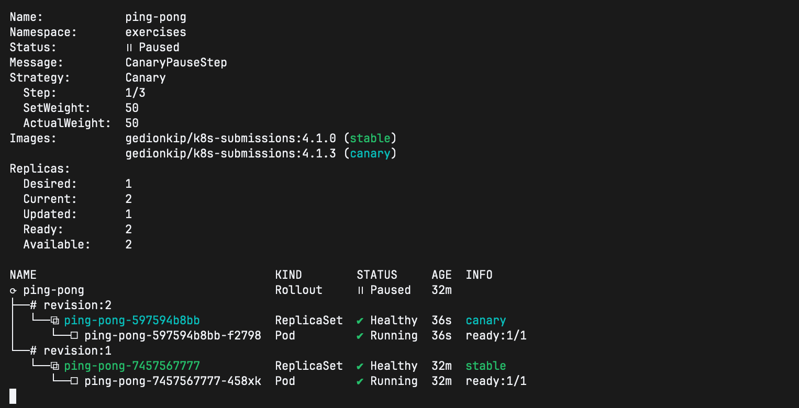

## Exercise 4.4: Canary

Apply the rollout and analysis-template manifests using kustomize:
```bash
## kustomization.yaml is in root folder
kubectl apply -k ..
```
**Check the rollout status**
```bash
kubectl argo rollouts list -n exercises
kubectl argo rollouts get rollout ping-pong -n exercises
```

**Trigger Update & Analysis**

Update the image to trigger a new rollout:
```bash
kubectl argo rollouts set image ping-pong ping-pong=gedionkip/k8s-submissions:4.1.3 -n exercises
```
Then watch the rollout and analysis:
```bash
kubectl argo rollouts get rollout ping-pong -n exercises --watch
```


You should see the AnalysisRun starting. If CPU usage stays below 0.2, it will proceed. If it spikes, it should fail and rollback.