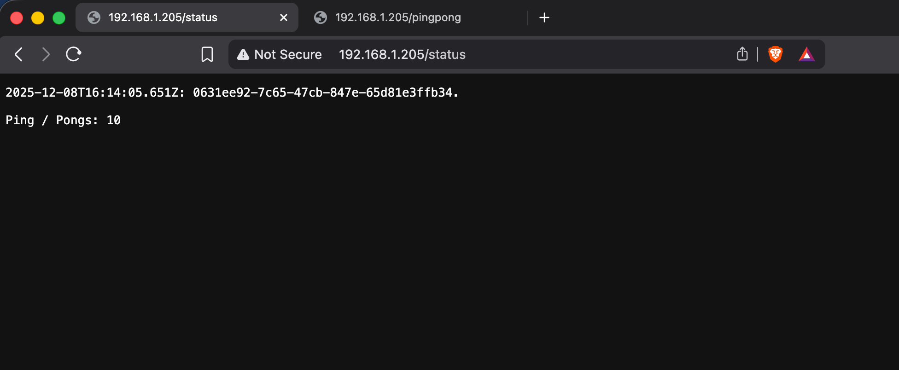

# Ping-pong and Log output
Implemented persistent shared storage between Ping-pong and Log Output applications. Both deployments mount `shared-data-pvc` at `/shared`.
The Ping-pong app persists the request counter and starts from the last saved value. The deployment has been updated to mount the PVC and set `COUNT_FILE`.
The log generator now writes logs to `/shared/status.log` via the PVC.

### Build and Push Images
```bash
# PING-PONG
docker buildx build \
  --platform linux/amd64,linux/arm64 \
  -t gedionkip/k8s-submissions:1.11.0 \
  --push \
  .

# LOG-GENERATOR
  cd ../log_output/log_generator
  docker buildx build \
    --platform linux/amd64,linux/arm64 \
    -t gedionkip/k8s-submissions:1.11.1 \
    --push \
    .

# LOG-READER
  cd ../log_reader
  docker buildx build \
    --platform linux/amd64,linux/arm64 \
    -t gedionkip/k8s-submissions:1.11.2 \
    --push \
    .
```
### Kubernetes Deployment

To provision the storage and deploy the applications:
```bash
kubectl apply -f ping_pong/manifests/
kubectl apply -f log_output/manifests/
```

### Access the endpoint
To see the applicaction endpoint which should show the latest timestamp/UUID and the persisted Ping / Pongs count:
```bash
curl http://INGRESS_IP/status
```

