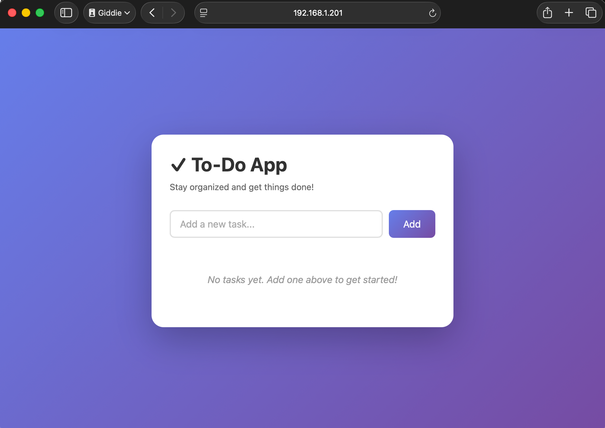

# To-do App

A minimal Node.js HTTP server that logs "Server started in port PORT" on startup. The server listens on the `PORT` environment variable, which defaults to `3000`.


### Build and Push Image

Build and push the image to Docker Hub repo: `gedionkip/k8s-submissions`:

```bash
docker buildx build \
  --platform linux/amd64,linux/arm64 \
  -t gedionkip/k8s-submissions:1.5 \
  --push \
  .
```

### Kubernetes deployment

```bash
# Apply the manifests
kubectl apply -f manifests/
```
### View the logs

View the output of the deployed web server:

```bash
kubectl logs -l app=todo-app
#OR
kubectl logs -f deployment/todo-app
```

### Access the application

Then open your browser and navigate to:

```bash
http://node-ip:30080
```


I'm running a 3-node K8s cluster instead of using K3s. In the screenshot is the IP address of one of the nodes.