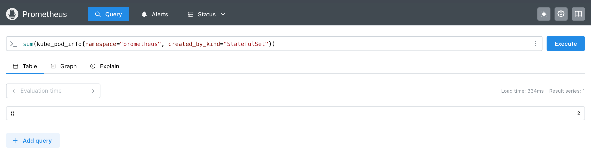

## Exercise 4.3: Prometheus 

### Prometheus Installation and Query
To query the number of pods created by StatefulSets in the `prometheus` namespace:
```bash
sum(kube_pod_info{namespace="prometheus", created_by_kind="StatefulSet"})
```
