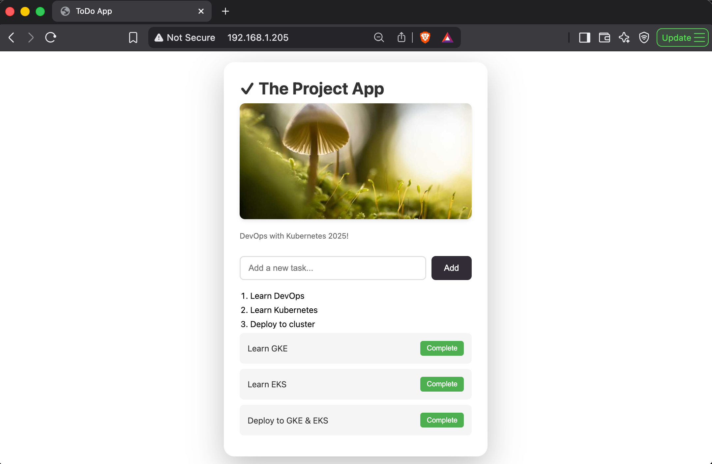

# To-do App with Backend Service

A simple to-do app that tracks your tasks and shows you a random image from Picsum every 10 minutes.
The application is now split into two microservices:
1. **Todo App (Frontend)**: Serves the HTML/JS and handles image caching.
2. **Todo Backend**: API service handling Todo items storage and retrieval.

Browser talks to `Todo App` for the UI and `Todo Backend` for `/todos` operations via Ingress.

## Build and Push Images

### Frontend (Todo App)
```bash
# Rebuild the todo-app image
docker buildx build \
  --platform linux/amd64,linux/arm64 \
  -t gedionkip/k8s-submissions:2.6 \
  --push \
  .
```

## Kubernetes Deployment

The application utilizes a **ConfigMap** to decouple configuration (like `IMAGE_URL`) from the code.

Then apply the manifests:

```bash
# Apply ConfigMap, PVC, Deployment, Services, Ingress
kubectl apply -f the_project/manifests/
```
## Access the application

The application is accessible via the Ingress Controller.

```bash
http://ingress-controller-ip/
```


