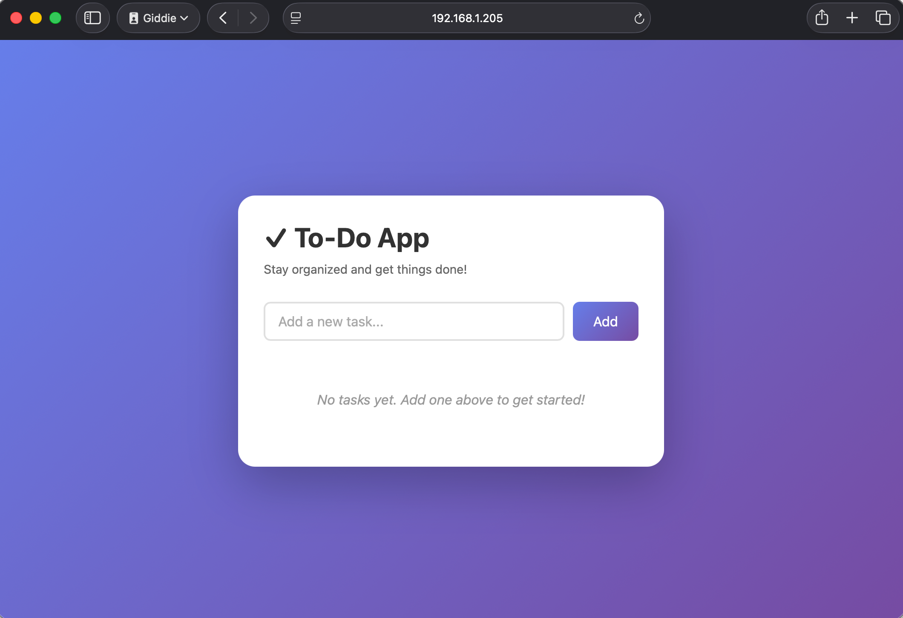

# To-do App

A minimal Node.js HTTP server that logs "Server started in port PORT" on startup. The server listens on the `PORT` environment variable, which defaults to `3000`.


### Build and Push Image

Build and push the image to Docker Hub repo: `gedionkip/k8s-submissions`:

```bash
docker buildx build \
  --platform linux/amd64,linux/arm64 \
  -t gedionkip/k8s-submissions:1.5 \
  --push \
  .
```

### Kubernetes deployment

```bash
# Apply the manifests
kubectl apply -f manifests/
```
### Check the created resources

Check the created service and ingress resource:
```bash
~❯ k get svc                                                       
NAME           TYPE        CLUSTER-IP      EXTERNAL-IP   PORT(S)     AGE
kubernetes     ClusterIP   10.233.0.1      <none>        443/TCP     40d
todo-app-svc   ClusterIP   10.233.48.197   <none>        30080/TCP   14m

~❯ k get ingress                                                
NAME          CLASS   HOSTS   ADDRESS         PORTS   AGE
the-project   nginx   *       192.168.1.205   80      13m
```
### Access the application

I'm running a 3-Node K8s cluster instead of using K3s. In the screenshot is the IP address of the ingress controller.

```bash
http://ingress-controller-ip/
```

