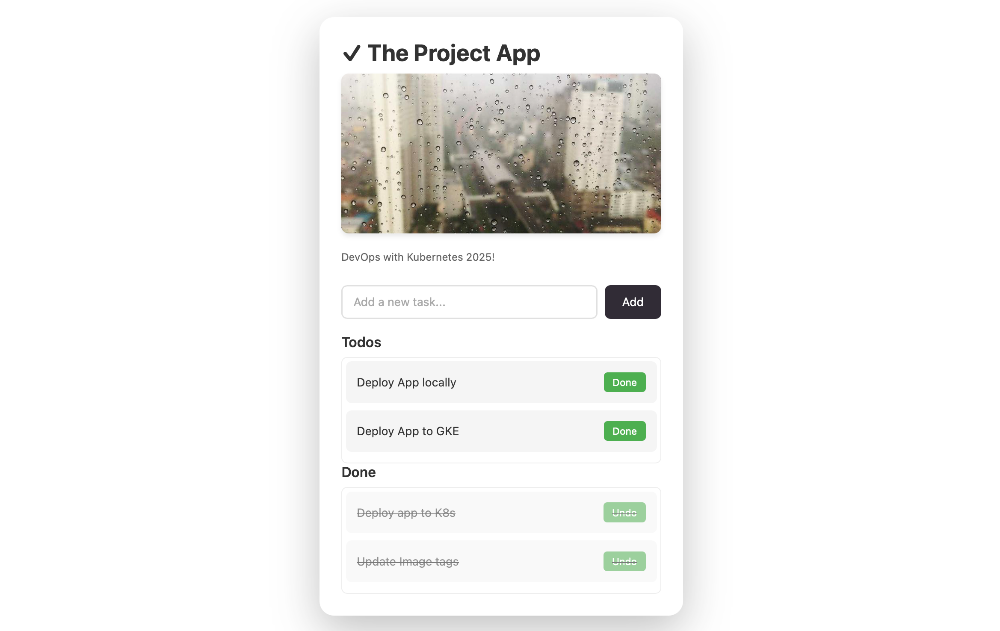

## Exercise 4.5: The Project, step 22

Separated the active and completed tasks into two lists, and added scrollbars to the lists to make them more manageable.

## Build the todo front-end image

```bash
docker buildx build \
  --platform linux/amd64,linux/arm64 \
  -t gedionkip/k8s-submissions:4.5 \
  --push \
  .
```
When the deployment workflow runs, the images will be build and pushed to GCR with the updated source code, and the new image used.

Access the UI after the deployment is ready:


