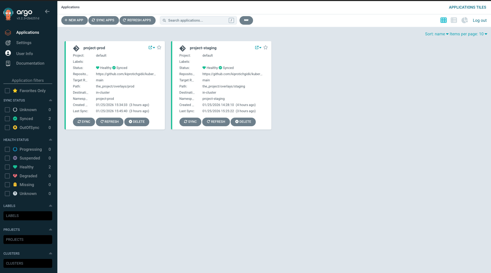

## Exercise 4.9: Staging & Production Environments

The project is split into two environments managed by GitOps:

- **Staging** (`project-staging`): Deploys on push to `main`.
- **Production** (`project-prod`): Deploys on push to tag (`v*`).

**Kustomize**:
  - `the_project/base`: Common manifests.
  - `the_project/overlays/staging`: Staging config (No backup, Log-only Broadcaster).
  - `the_project/overlays/prod`: Production conftig (Has Backup, Full Broadcaster).

**CI Pipeline**: [`.github/workflows/project.yaml`](../.github/workflows/project.yaml)
  - Detects branch/tag.
  - Builds images.
  - Updates the kustomization file in the correct overlay.

### Deployment
**Deploy Staging**:
  ```bash
  kubectl apply -f manifests/argocd-staging.yaml
  ```
**Deploy Production**:
  ```bash
  kubectl apply -f manifests/argocd-prod.yaml
  ```
Pushing to `main` updates `project-staging` namespace.
Tagged pushes to main updates the `project-prod` namespace resources.

