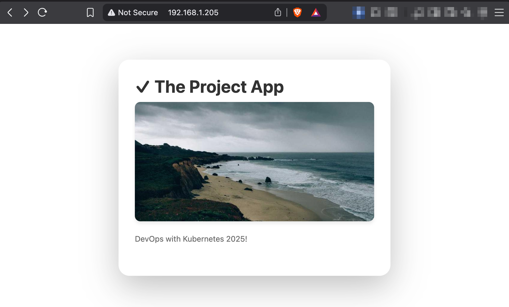

# To-do App

A simple to-do app that tracks your tasks and shows you a random image from Picsum every 10 minutes.


### Build and Push Image

Build and push the image to Docker Hub repo: `gedionkip/k8s-submissions`:

```bash
docker buildx build \
  --platform linux/amd64,linux/arm64 \
  -t gedionkip/k8s-submissions:1.12.3 \
  --push \
  .
```

### Kubernetes deployment

```bash
# Apply the manifests
kubectl apply -f manifests/
```

### Access the application

I'm running a 3-Node K8s cluster instead of using K3s. In the screenshot is the IP address of the ingress controller.

```bash
http://ingress-controller-ip/
```

