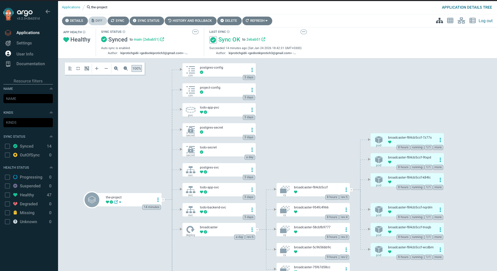

## Exercise 4.8: The Project GitOps

The main project applications (Frontend, Backend, Broadcaster) are managed using **GitOps** principles with ArgoCD.

**GitOps Controller**: ArgoCD (`the_project/manifests/argocd.yaml`).

**CI Pipeline**: [`.github/workflows/project.yaml`](../.github/workflows/project.yaml)
  - Builds images for `todo-app`, `todo-backend`, and `broadcaster`.
  - Updates `the_project/kustomization.yaml` with the new image tags.
  - Pushes changes to `main`.

Deploy ArgoCD Application:
```bash
kubectl apply -f manifests/argocd.yaml
```
This creates the `the-project` application in ArgoCD, syncing the `the_project` directory.

Pushed workflow file to GitHub to trigger the CI pipeline.

