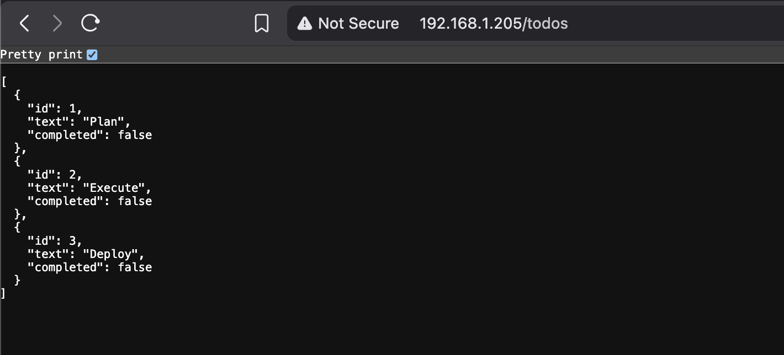

# To-do App with Backend Service

A simple to-do app that tracks your tasks and shows you a random image from Picsum every 10 minutes.
The application is now split into two microservices:
1. **Todo App (Frontend)**: Serves the HTML/JS and handles image caching.
2. **Todo Backend**: Stores todo items in a PostgreSQL database.

Browser talks to `Todo App` for the UI and `Todo Backend` for `/todos` operations via Ingress.

### Rebuild the Todo Backend
```bash
# Rebuild the todo-app image
docker buildx build \
  --platform linux/amd64,linux/arm64 \
  -t gedionkip/k8s-submissions:2.8 \
  --push \
  .
```

## Kubernetes Deployment

The application utilizes **ConfigMaps** and **Secrets** to decouple configurations such as the Database credentials and the Image URL from the code.

Apply the manifests:

```bash
kubectl apply -f the_project/manifests/
```
## Access the Postgres DB

```bash
~❯ kubectl exec -it -n project postgres-db-0 -- psql -U postgres
psql (17.7 (Debian 17.7-3.pgdg13+1))
Type "help" for help.

postgres=# SELECT * FROM todos;
 id |  text   | completed
----+---------+-----------
  1 | Plan    | f
  2 | Execute | f
  3 | Deploy  | f
(3 rows)
```
To test persistence, we delete the pod and let it recreate then check the todo list again:
```bash
~❯kubectl delete pod -n project -l app=todo-app

~❯kubectl get pods -n project
NAME                        READY   STATUS    RESTARTS   AGE
postgres-db-0               1/1     Running   0          41m
todo-app-78d98d9969-65ppm   2/2     Running   0          44s
```
Access the `/todos` endpoint to see the todos list:

