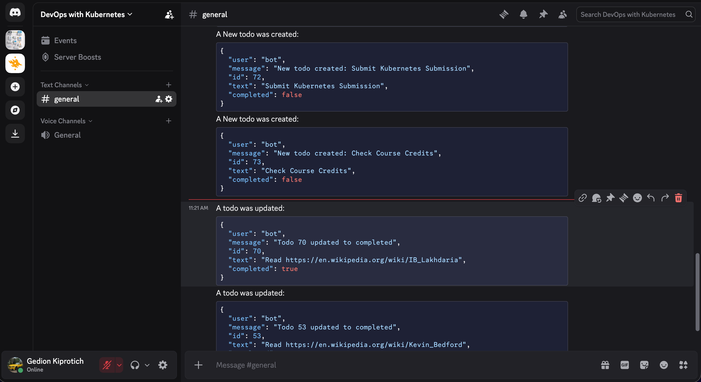

### Exercise 4.6: Broadcaster Service
Authentication is disabled for NATS.

**Install NATS**:
 ```bash
 helm repo add bitnami https://charts.bitnami.com/bitnami
 helm repo update
 helm install my-nats bitnami/nats -f nats-values.yaml
 ```

**Deploy Broadcaster**:
 The broadcaster service listens to NATS messages and forwards them to a Discord Webhook URL (configured in `manifests/secret.yaml`).
  
 Apply the manifests:
 ```bash
 kubectl apply -k .
 ```

**Verify**:
 Scale to 6 replicas is defined in `manifests/broadcaster.yaml`.

 ```bash
 ❯ k get deployments project

NAME          READY   UP-TO-DATE   AVAILABLE   AGE
broadcaster   6/6     6            6           14h
todo-app      1/1     1            1           2d19h
 ```

 Check logs to ensure messages are processed only once per event across the 6 replicas.
```json
Received message: {
  user: 'bot',
  message: 'New todo created: Play Video Games',
  id: 69,
  text: 'Play Video Games',
  completed: false
```
In the discord server:
