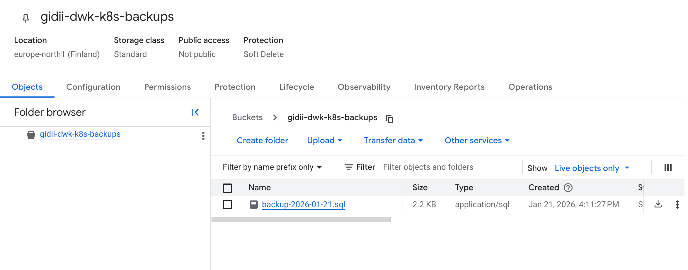

# Exercise 3.10: The project, step 18

A CronJob is configured to backup the Postgres database to Google Cloud Storage (GCS) daily.

- **Manifest**: `manifests/backup-cronjob.yaml`
- **Schedule**: `0 0 * * *` (Daily at Midnight UTC).
- **Process**:
    1.  Uses `postgres:17` image (matching the DB version).
    2.  Installs Google Cloud SDK (`gcloud`, `gsutil`).
    3.  Runs `pg_dump` to create an SQL dump.
    4.  Uploads the dump to `gs://gidii-dwk-k8s-backups/`.

Create the secret:

```bash
kubectl create secret generic gcs-key \
  --from-file=key.json=/path/to/my/service-account-key.json \
  -n project
```
Create the GCS Bucket using the Google Cloud Console, then push the configuration to GitHub to deploy the CronJob via the deployment workflow.

When the job runs, it will create a backup of the Postgres database and upload it to the GCS bucket.



