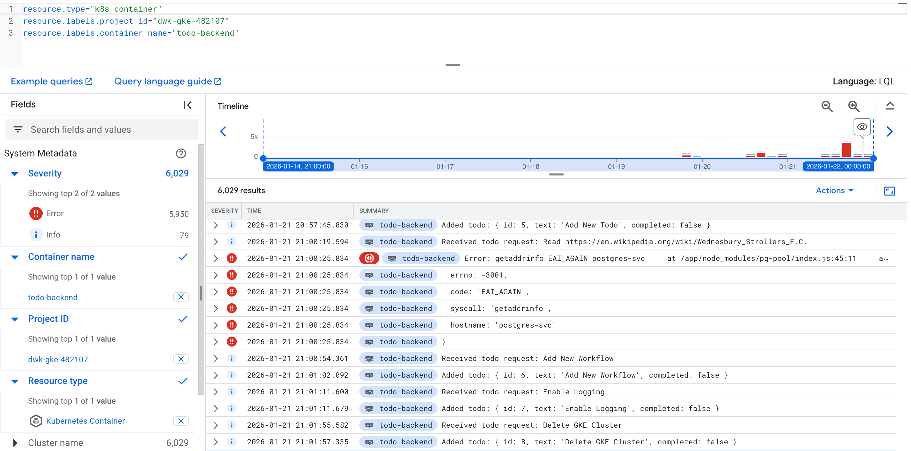

## Exercise 3.12: The project, step 20

## GKE Monitoring

GKE has Cloud Logging and Monitoring enabled by default. To verify that logs are being captured:

On the Google Cloud Console > **Logging** > **Logs Explorer**.

Query for the backend pod:
```
resource.type="k8s_container"
resource.labels.project_id="YOUR_PROJECT_ID"
resource.labels.container_name="todo-backend"
```



