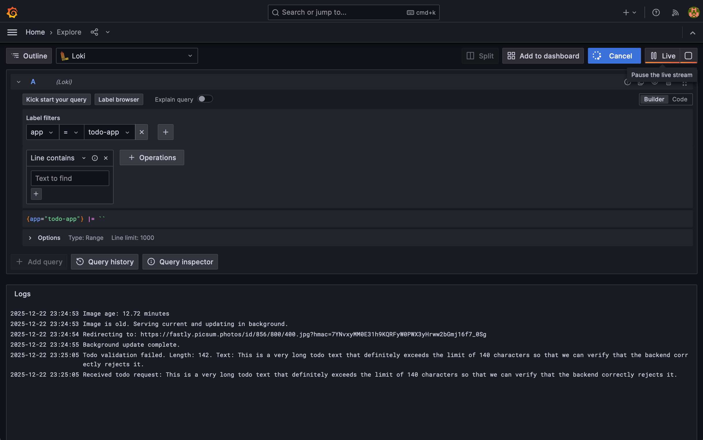

## Monitoring (Grafana + Loki)
Add the Helm repository for the `loki-stack` chart:
```bash
helm repo add grafana https://grafana.github.io/helm-charts
helm repo update
```

Install the `loki-stack` chart:
```bash
helm install loki-stack grafana/loki-stack \
    --set grafana.enabled=true \
    --namespace=loki-stack --create-namespace
```

Logging and monitoring are deployed in the `loki-stack` namespace using `loki-stack`.

### Access Grafana

**Get Admin Password**:
   ```bash
   kubectl get secret --namespace loki-stack loki-stack-grafana -o jsonpath="{.data.admin-password}" | base64 --decode ; echo
   ```

**Port-Forward**:
   ```bash
   kubectl port-forward --namespace loki-stack service/loki-stack-grafana 3000:80
   ```

**Login**:
   - URL: `http://localhost:3000`
   - User: `admin`
   - Password: (output from step 1)

### Check Live Logs in Grafana
1. Go to **Explore**.
2. Select **Loki** as the data source.
3. Query: `{app="todo-app"}`
4. Trigger a log (e.g., send a too-long todo):
   ```bash
   curl -X POST -H "Content-Type: application/json" -d '{"text":"This is a very long todo text that definitely exceeds the limit of 140 characters so that we can verify that the backend correctly rejects it and logs a warning message as intended."}' http://ingress-ip/todos
   ```
5. Observe the warning log in Grafana.

