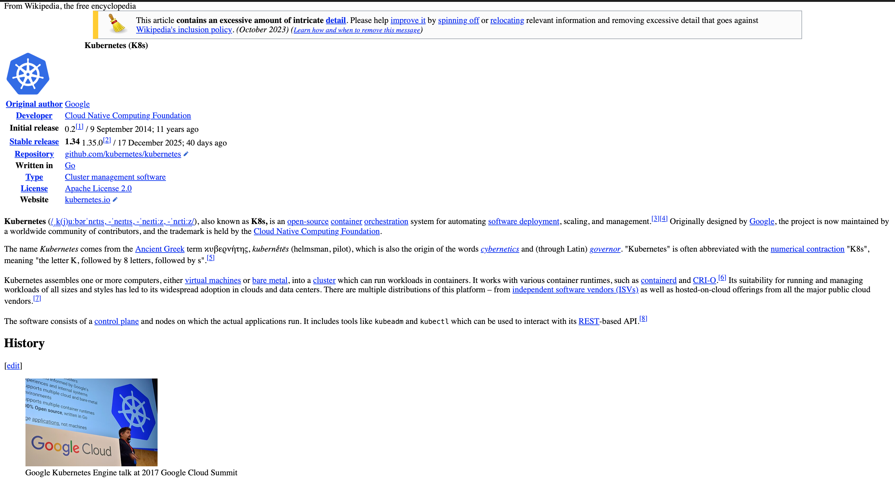
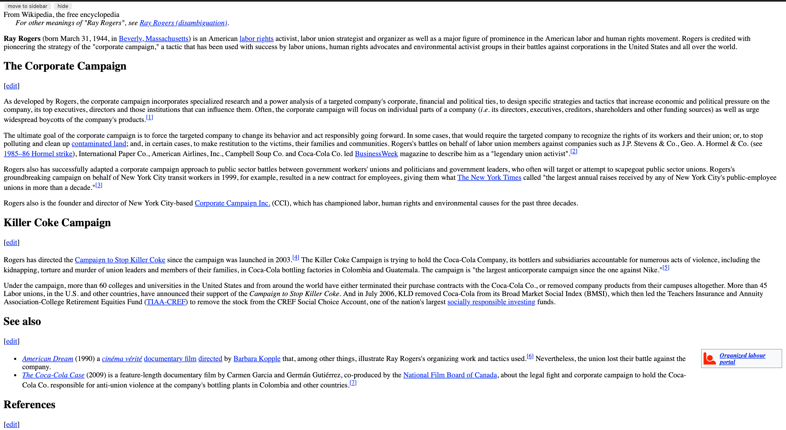

# Exercise 5.4: Wikipedia Loader

An application that serves Wikipedia pages using a multi-container Pod pattern.

## Deployment

```bash
kubectl apply -k wikipedia_loader/
```
Check the pods:

```bash
❯ k get pods -n exercises
NAME                                      READY   STATUS    RESTARTS   AGE
wikipedia-gateway-istio-bcb44f74d-lkhbv   1/1     Running   0          3m28s
wikipedia-loader-5c7549697f-mknwt         2/2     Running   0          3m28s
```

**Initial Page Load**:

An immediate access, before 5 minutes elapse, should show the Kubernetes Wikipedia page:



**Page Load after 5-15 minutes**: 

Waiting (5-15 mins) the reloading the page should show a random Wikipedia page.

